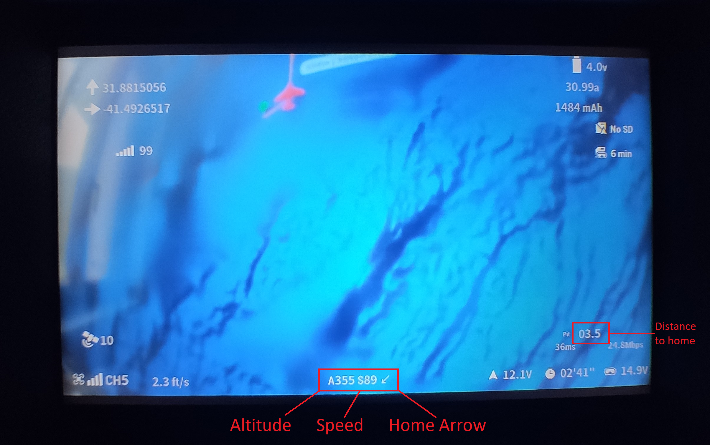
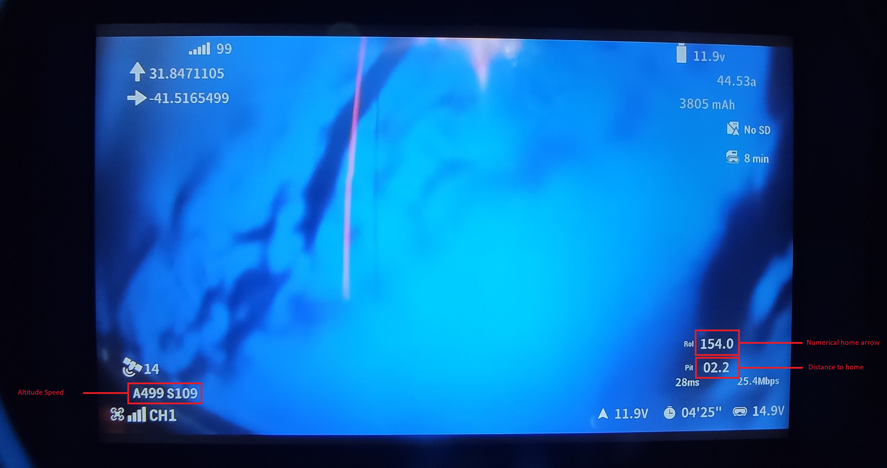
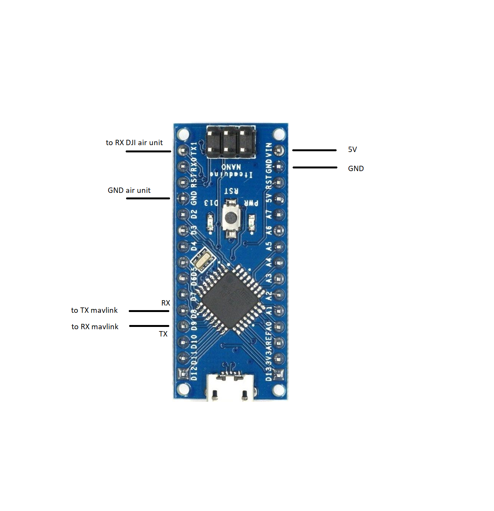
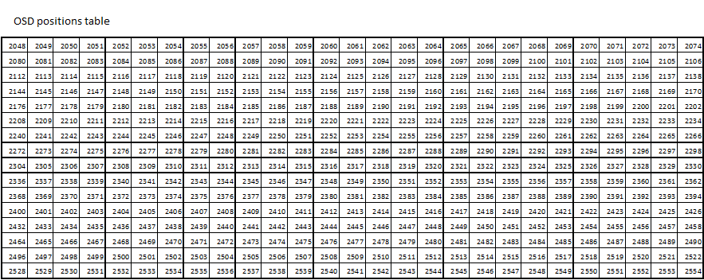

#DJI HD FPV Mavlink to MSP - Full OSD for DJI firmware version V01.00.0500

Converts Ardupilot Mavlink telemetry data to MSP telemetry data compatible with the DJI HD FPV system.
# 
 Arduino Nano TX to DJI Air unit RX(115200)
 Softwareserial RX is digital pin 8 connected to ardupilot TX telemetry port(57600)
 Softwareserial TX is digital pin 9 connected to ardupilot RX telemetry port(57600)

#

